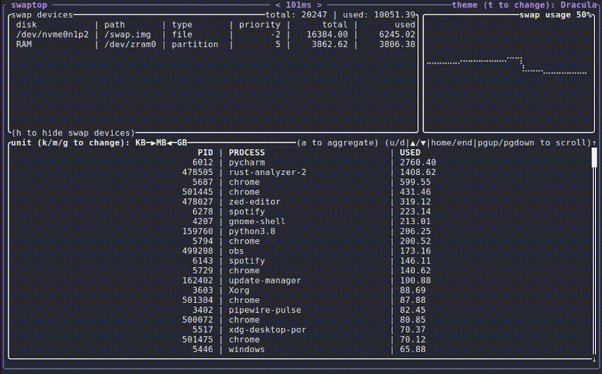
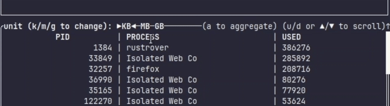
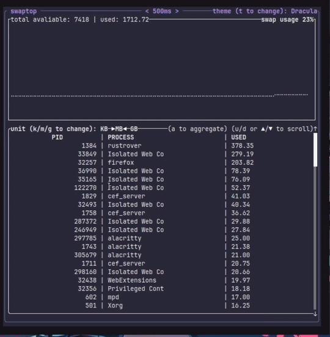

# Swaptop
A real-time swap usage monitor for Linux and Windows systems with TUI interface. Lists processes using swap, displays consumption per-process/per-software, and provides live-updating graphs.


[](https://crates.io/crates/swaptop)
[](https://ratatui.rs/)



> [!TIP]
> Blog post about this project: https://blog.wired.rs/posts/swaptop

## Features

- Real-time animated swap usage graph
- List Swap devices with usage per disk / type
- Process-level swap consumption tracking
- Grouped view by software (aggregate mode)
- Multiple color themes (Dracula, Solarized, Monokai, Nord)
- Unit conversion (KB/MB/GB)
- **Mouse interaction** — click buttons, drag dividers to resize panels, scroll lists
- **Process info panel** — select a process with ↑/↓ or click, press Enter for details (PID, name, swap, exe path, state, VmPeak, VmSize, VmRSS, VmData, VmStk, threads, UID)
- **Info sidebar** — persistent sidebar with all process details when info panel is open
- **Panel focus system** — press `w`/`s` to cycle focus, `l`/`r` to resize the active panel's divider
- **Help popup** — press `?` for all keyboard shortcuts
- **Configuration persistence** — settings saved to `~/.config/swaptop/config.toml`
- Lightweight (<5MB memory usage)

## Installation

### Linux
### Prerequisites
- [Rust (latest stable)](https://rustup.rs/)
- Linux kernel 4.4+
- procfs mounted at `/proc`

```bash
cargo install swaptop
```

### Windows
- Acess: https://github.com/luis-ota/swaptop/releases
- Download the windows verison
- Extract it
- Execute the .exe or call it from a terminal 

## Usage 

### Basic Launch
```bash
swaptop
```

### Keyboard Controls

| Key              | Action                          |
|------------------|---------------------------------|
| `q`/`Esc`        | Quit application                |
| `?`              | Toggle help popup               |
| `k`/`m`/`g`      | Switch units (KB/MB/GB)         |
| `h`              | Hide / Show swap devices        |
| `a`              | Toggle aggregate mode           |
| `t`              | Cycle through themes            |
| `↑`/`u`          | Select previous process         |
| `↓`/`d`          | Select next process             |
| `Home`           | Go to first process             |
| `End`            | Go to last process              |
| `PgUp`           | One page up                     |
| `PgDown`         | One page down                   |
| `Enter`          | Open/close process info panel  |
| `Ctrl+C`         | Force quit                      |
| `←` / `→`        | Decrease / Increase interval    |
| `w` / `s`        | Cycle focused panel             |
| `l` / `r`        | Resize focused panel divider    |

### Mouse Controls

| Action                | Result                      |
|-----------------------|-----------------------------|
| Click KB/MB/GB        | Change unit                 |
| Click "a to aggregate"| Toggle aggregate mode       |
| Click `⬌` divider     | Drag to resize panels       |
| Scroll over list      | Scroll process list         |
| Click a process row   | Select + open info panel    |
| Scroll over info      | Scroll info panel           |



## Themes

Cycle through 5 beautiful themes:
1. Dracula (default)
2. Solarized
3. Monokai
4. Nord
5. Default

Press `t` to cycle themes live.



## Technical Details

### Data Collection
- Reads `/proc/meminfo` for system swap stats
- Parses `/proc/[pid]/status` for per-process swap
- Uses procfs crate for safe access

### Performance
- Updates every 1 second by default
- <1% CPU usage on modern systems
- Memory footprint: ~4MB


## Troubleshooting

**No swap data showing?**
- Ensure you have active swap partitions/files
```bash
swapon --show
```

**Permission issues?**
Run with:
```bash
sudo -E swaptop
```
## Contributors

<table>
<tr>
  <td align="center" style="word-wrap: break-word; width: 150.0; height: 150.0">
        <a href=https://github.com/luis-ota>
            
            <br />
            <sub style="font-size:14px"><b>luis</b></sub>
        </a>
    </td>
    <td align="center" style="word-wrap: break-word; width: 150.0; height: 150.0">
        <a href=https://github.com/kpcyrd>
            
            <br />
            <sub style="font-size:14px"><b>kpcyrd</b></sub>
        </a>
    </td>
    <td align="center" style="word-wrap: break-word; width: 150.0; height: 150.0">
        <a href=https://github.com/RafaelKC>
            
            <br />
            <sub style="font-size:14px"><b>Rafael Chicovis</b></sub>
        </a>
    </td>
</tr>
</table>

## License 

MIT License - © 2025 luis

---

no matter where you are everyone is always connected

⠀⠀⠀⠀⠀⠀⠀⠀⠀⠀⠀⠀⠀⠀⠀⠀⠀⠀⠀⠀⠀⠀⠀⠀⠀⠀⠀⠀⠀⣀⡤⢤⣤⣤⣄⠀⠀⠀⠀⠀⠀⠀⠀⠀⠀⠀⠀⠀⠀⠀⠀⠀⠀⠀⠀⠀⠀⠀⠀⠀⠀⠀⠀⠀⠀
⠀⠀⠀⠀⠀⠀⠀⠀⠀⠀⠀⠀⠀⠀⠀⠀⠀⠀⠀⠀⠀⠀⠀⠀⠀⢀⣶⣧⣐⠍⢙⣀⣼⣿⣿⣅⡐⠆⠀⠀⠀⠀⠀⠀⠀⠀⠀⠀⠀⠀⠀⠀⠀⠀⠀⠀⠀⠀⠀⠀⠀⠀⠀⠀⠀
⠀⠀⠀⠀⠀⠀⠀⠀⠀⠀⠀⠀⠀⠀⠀⠀⠀⠀⠀⠀⠀⠀⠀⠀⠀⢀⡀⠀⠉⠙⠻⣿⣿⣿⣿⣿⣯⣄⠀⠀⠀⠀⠀⠀⠀⠀⠀⠀⠀⠀⠀⠀⠀⠀⠀⠀⠀⠀⠀⠀⠀⠀⠀⠀⠀
⠀⠀⠀⠀⠀⠀⠀⠀⠀⠀⠀⠀⠀⠀⠀⠀⠀⠀⠀⠀⠠⣶⠆⠀⢀⣺⡃⣀⠀⠀⠀⠈⢿⣿⣿⣿⣿⡿⠀⠀⠀⠀⠀⠀⠀⠀⠀⠀⠀⠀⠀⠀⠀⠀⠀⠀⠀⠀⠀⠀⠀⠀⠀⠀⠀
⠀⠀⠀⠀⠀⠀⠀⠀⠀⠀⠀⠀⠀⠀⠀⠀⠀⠀⠀⣸⣷⣼⠆⠀⡌⢹⣿⣿⠀⢄⠀⠀⠈⣿⣿⣿⣿⠃⠀⠀⠀⠀⠀⠀⠀⠀⠀⠀⠀⠀⠀⠀⠀⠀⠀⠀⠀⠀⠀⠀⠀⠀⠀⠀⠀
⠀⠀⠀⠀⠀⠀⠀⠀⠀⠀⠀⠀⠀⠀⠀⠀⠀⠀⢀⣿⣿⣿⠀⠸⣷⣿⣿⣿⣆⣠⣿⡄⠀⣼⣿⣿⣿⠀⠀⠀⠀⠀⠀⠀⠀⠀⠀⠀⠀⠀⠀⠀⠀⠀⠀⠀⠀⠀⠀⠀⠀⠀⠀⠀⠀
⠀⠀⠀⠀⠀⠀⠀⠀⠀⠀⠀⠀⠀⠀⠀⠀⠀⠀⢸⣿⣿⣿⠂⠀⠹⡿⣿⣿⣿⣿⣿⠀⠀⠟⠈⠏⠀⠀⠀⠀⠀⠀⠀⠀⠀⠀⠀⠀⠀⠀⠀⠀⠀⠀⠀⠀⠀⠀⠀⠀⠀⠀⠀⠀⠀
⠀⠀⠀⠀⠀⠀⠀⠀⠀⠀⠀⠀⠀⠀⠀⠀⠀⠀⣿⣿⣿⠏⢰⣿⣦⡀⠚⠛⢿⣿⡿⠀⠀⢸⠇⢀⠀⠀⠀⠀⠀⠀⠀⠀⠀⠀⠀⠀⠀⠀⠀⠀⠀⠀⠀⠀⠀⠀⠀⠀⠀⠀⠀⠀⠀
⠀⠀⠀⠀⠀⠀⠀⠀⠀⠀⠀⠀⠀⠀⠀⠀⠀⢠⢿⣿⣿⠀⢾⣿⣿⡇⢻⡏⠀⠀⠀⠀⠀⡆⢰⣿⣿⡗⢠⣿⣿⣷⣦⣤⣤⣀⣤⣀⣀⠀⠀⠀⠀⠀⠀⠀⠀⠀⠀⠀⠀⠀⠀⠀⠀
⠀⠀⠀⠀⠀⠀⠀⠀⠀⠀⠀⠀⠀⠀⠀⠀⠀⠀⠀⠈⠙⠒⠿⠿⣿⣿⠸⠇⠀⠀⠀⠀⠀⣷⠘⣿⠟⣠⣿⣿⣿⣿⣿⣿⣿⣿⣿⣿⣿⣿⣿⣿⣷⢆⣠⠀⠀⠀⠀⠀⠀⠀⠀⠀⠀
⠀⠀⠀⠀⠀⠀⠀⠀⠀⠀⠀⠀⠀⠀⠀⠀⠀⠀⠀⠀⠀⠀⠀⠀⠀⢸⣧⠀⠀⠀⠀⠀⠀⣿⠀⣃⣾⣿⣿⣿⣿⣿⣿⣿⣿⣿⣿⣿⣿⣿⣿⡿⠏⠘⠉⠀⠀⠀⠀⠀⠀⠀⠀⠀⠀
⠀⠀⠀⠀⠀⠀⠀⠀⠀⠀⠀⠀⠀⠀⠀⠀⠀⠀⠀⠀⠀⠀⠀⠀⠀⢸⣧⠀⠀⠀⠀⠀⠀⢄⣸⣿⣿⣿⣿⣭⣭⡉⠉⠉⠉⠈⠉⠀⠉⠉⠁⠀⠀⠀⠀⠀⠀⠀⠀⠀⠀⠀⠀⠀⠀
⠀⠀⠀⠀⠀⠀⠀⠀⠀⠀⠀⠀⠀⠀⠀⠀⠀⠀⠀⠀⠀⠀⠀⠀⠀⢸⠛⢸⡄⠀⠀⠀⠀⢸⣿⣿⣿⣿⣿⣿⣿⣧⠀⠀⠀⠀⠀⠀⠀⠀⠀⠀⠀⠀⠀⠀⠀⠀⠀⠀⠀⠀⠀⠀⠀
⠀⠀⠀⠀⠀⠀⠀⠀⠀⠀⠀⠀⠀⠀⠀⠀⠀⠀⠀⠀⠀⠀⠀⠀⠀⢸⣶⢸⣷⠀⠀⠀⠀⠈⣇⣽⣿⣿⣿⣿⣿⣿⡆⠀⠀⠀⠀⠀⠀⠀⠀⠀⠀⠀⠀⠀⠀⠀⠀⠀⠀⠀⠀⠀⠀
⠀⠀⠀⠀⠀⠀⠀⠀⠀⠀⠀⠀⠀⠀⠀⠀⠀⠀⠀⠀⠀⠀⠀⠀⠀⠸⠛⠈⠉⠀⠀⠀⠀⠀⢸⣿⣿⣿⣿⣿⣿⣿⠇⠀⠀⠀⠀⠀⠀⠀⠀⠀⠀⠀⠀⠀⠀⠀⠀⠀⠀⠀⠀⠀⠀
⠀⠀⠀⠀⠀⠀⠀⠀⠀⠀⠀⠀⠀⠀⠀⠀⠀⠀⠀⠀⠀⠀⠀⠀⠀⠁⢷⡆⠀⠀⠀⠀⠀⠀⠈⣄⣼⣿⣿⣿⣿⠃⠀⠀⠀⠀⠀⠀⠀⠀⠀⠀⠀⠀⠀⠀⠀⠀⠀⠀⠀⠀⠀⠀⠀
⠀⠀⠀⠀⠀⠀⠀⠀⠀⠀⠀⠀⠀⠀⠀⠀⠀⠀⠀⠀⠀⠀⠀⠀⠀⠀⠈⠃⠀⠀⠀⠀⠀⠀⠀⢹⠛⢿⣿⠟⠁⣀⠀⠀⠀⠀⠀⠀⠀⠀⠀⠀⠀⠀⠀⠀⠀⠀⠀⠀⠀⠀⠀⠀⠀
⠀⠀⠀⠀⠀⠀⠀⠀⠀⠀⠀⠀⠀⠀⠀⠀⠀⠀⠀⠀⠀⠀⠀⠀⠀⠀⠀⠚⠀⣴⡀⢰⡆⢀⣤⣄⣒⡉⠀⣶⣀⣎⠀⠀⠀⠀⠀⠀⠀⠀⠀⠀⠀⠀⠀⠀⠀⠀⠀⠀⠀⠀⠀⠀⠀
⠀⠀⠀⠀⠀⠀⠀⠀⠀⠀⠀⠀⠀⠀⠀⠀⠀⠀⠀⠀⠀⠀⠀⠀⠀⠀⠀⠀⣰⣿⣿⡟⠀⣼⡿⣷⢾⠇⢠⣿⣿⣿⠀⠀⠀⠀⠀⠀⠀⠀⠀⠀⠀⠀⠀⠀⠀⠀⠀⠀⠀⠀⠀⠀⠀
⠀⠀⠀⠀⠀⠀⠀⠀⠀⠀⠀⠀⠀⠀⠀⠀⠀⠀⠀⠀⠀⠀⠀⠀⠀⠀⠀⢀⣉⠛⠛⠁⢴⣽⣷⣧⣼⡄⠸⣽⡿⠟⠀⠀⠀⠀⠀⠀⠀⠀⠀⠀⠀⠀⠀⠀⠀⠀⠀⠀⠀⠀⠀⠀⠀
⠀⠀⠀⠀⠀⠀⠀⠀⠀⠀⠀⠀⠀⠀⠀⠀⠀⠀⠀⠀⠀⠀⠀⠀⠀⠀⢀⣼⣿⣿⣿⣯⣿⣿⣿⣿⣿⣷⡶⣦⣴⡦⠀⠀⠀⠀⠀⠀⠀⠀⠀⠀⠀⠀⠀⠀⠀⠀⠀⠀⠀⠀⠀⠀⠀
⠀⠀⠀⠀⠀⠀⠀⠀⠀⠀⠀⠀⠀⠀⠀⠀⠀⠀⠀⠀⠀⠀⠀⠀⠀⠀⣸⣿⣿⣿⣿⣿⣿⣿⣿⣿⣿⣿⡯⢽⢿⡇⠀⠀⠀⠀⠀⠀⠀⠀⠀⠀⠀⠀⠀⠀⠀⠀⠀⠀⠀⠀⠀⠀⠀
⠀⠀⠀⠀⠀⠀⠀⠀⠀⠀⠀⠀⠀⠀⠀⠀⠀⠀⠀⠀⠀⠀⠀⠀⠀⢠⣿⣿⣿⣿⣿⣿⣿⣿⣿⣿⣿⣿⣿⣷⣿⡇⠀⠀⠀⠀⠀⠀⠀⠀⠀⠀⠀⠀⠀⠀⠀⠀⠀⠀⠀⠀⠀⠀⠀
⠀⠀⠀⠀⠀⠀⠀⠀⠀⠀⠀⠀⠀⠀⠀⠀⠀⠀⠀⠀⠀⠀⠀⠀⢀⣿⣿⣿⣿⣿⣿⣿⣿⣿⣿⣿⣿⣿⣿⣿⣿⡇⠀⠀⠀⠀⠀⠀⠀⠀⠀⠀⠀⠀⠀⠀⠀⠀⠀⠀⠀⠀⠀⠀⠀
⠀⠀⠀⠀⠀⠀⠀⠀⠀⠀⠀⠀⠀⠀⠀⠀⠀⠀⠀⠀⠀⠀⠀⠀⣾⣿⣿⣿⣿⣿⣿⣿⣿⣿⣿⣿⣿⣿⣿⢿⣿⡇⠀⠀⠀⠀⠀⠀⠀⠀⠀⠀⠀⠀⠀⠀⠀⠀⠀⠀⠀⠀⠀⠀⠀
⠀⠀⠀⠀⠀⠀⠀⠀⠀⠀⠀⠀⠀⠀⠀⠀⠀⠀⠀⠀⠀⠀⠀⣸⣿⣿⣿⣿⣿⣿⣿⣿⣿⣿⣿⣿⣿⣿⣿⣰⣿⡇⠀⠀⠀⠀⠀⠀⠀⠀⠀⠀⠀⠀⠀⠀⠀⠀⠀⠀⠀⠀⠀⠀⠀
⠀⠀⠀⠀⠀⠀⠀⠀⠀⠀⠀⠀⠀⠀⠀⠀⠀⠀⠀⠀⠀⠀⠴⣿⣿⣿⣿⣿⣿⣿⣿⣿⣿⣿⣿⣿⣿⣿⣷⢾⣿⡇⠀⠀⠀⠀⠀⠀⠀⠀⠀⠀⠀⠀⠀⠀⠀⠀⠀⠀⠀⠀⠀⠀⠀
⠀⠀⠀⠀⠀⠀⠀⠀⠀⠀⠀⠀⠀⠀⠀⠀⠀⠀⠀⠀⠀⠐⠀⠀⠉⠙⠛⠻⠿⣿⣿⣿⣿⣿⣿⣿⣿⣿⣏⣾⣿⡇⠀⠀⠀⠀⠀⠀⠀⠀⠀⠀⠀⠀⠀⠀⠀⠀⠀⠀⠀⠀⠀⠀⠀
⠀⠀⠀⠀⠀⠀⠀⠀⠀⠀⠀⠀⠀⠀⠀⠀⠀⠀⠀⠀⠀⠀⠀⠀⠀⠀⠀⠀⠀⠀⠈⠉⠙⠛⠻⠿⢿⣿⣿⣿⣿⡇⠀⠀⠀⠀⠀⠀⠀⠀⠀⠀⠀⠀⠀⠀⠀⠀⠀⠀⠀⠀⠀⠀⠀
⠀⠀⠀⠀⠀⠀⠀⠀⠀⠀⠀⠀⠀⠀⠀⠀⠀⠀⠀⠈⢰⣶⠀⠇⠀⠀⠀⠀⠀⠀⠀⠀⠀⠀⠀⠀⠀⠀⠈⠉⠙⠃⠀⠀⠀⠀⠀⠀⠀⠀⠀⠀⠀⠀⠀⠀⠀⠀⠀⠀⠀⠀⠀⠀⠀
⠀⠀⠀⠀⠀⠀⠀⠀⠀⠀⠀⠀⠀⠀⠀⠀⠀⠀⠀⠀⢸⣿⠀⠀⠀⠀⠀⠀⠀⠀⠀⠀⠀⠀⠀⠀⠀⠀⠀⠀⠀⠀⠀⠀⠀⠀⠀⠀⠀⠀⠀⠀⠀⠀⠀⠀⠀⠀⠀⠀⠀⠀⠀⠀⠀
⠀⠀⠀⠀⠀⠀⠀⠀⠀⠀⠀⠀⠀⠀⠀⠀⠀⠀⠀⠀⠘⠋⠀⠀⠀⠀⠀⠀⠀⠀⠀⠀⠀⠀⠀⠀⣼⣿⠀⠀⠀⠀⠀⠀⠀⠀⠀⠀⠀⠀⠀⠀⠀⠀⠀⠀⠀⠀⠀⠀⠀⠀⠀⠀⠀
⠀⠀⠀⠀⠀⠀⠀⠀⠀⠀⠀⠀⠀⠀⠀⠀⠀⠀⠀⠀⠀⠀⠀⠀⠀⠀⠀⠀⠀⠀⠀⠀⠀⠀⠀⠘⠛⠋⠀⠀⠀⠀⠀⠀⠀⠀⠀⠀⠀⠀⠀⠀⠀⠀⠀⠀⠀⠀⠀⠀⠀⠀⠀⠀⠀
